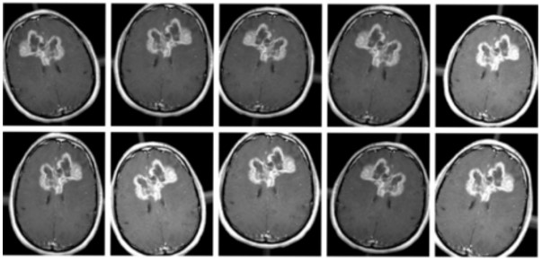
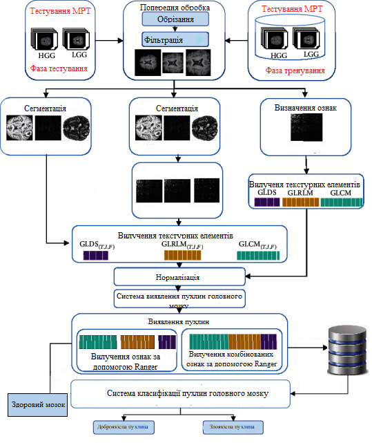
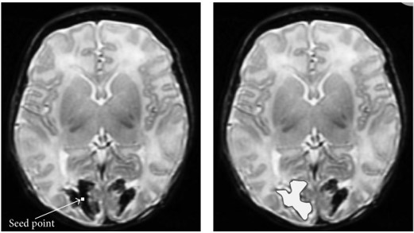
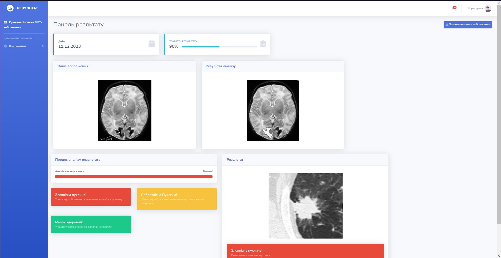

# Інтелектуальна система визначення та класифікації злоякісних пухлин мозку

Архітектура була натхненна: 
[U-Net: Convolutional Networks for Biomedical Image Segmentation](http://lmb.informatik.uni-freiburg.de/people/ronneber/u-net/).
[BrainWeb: База даних імітаційного моделювання мозку. Доступно онлайн: ](https://brainweb.bic.mni.mcgill.ca/brainweb/).
---

## Огляд

### Дані

Оригінальний набір даних із [Дані отримані з Figshare Доступно онлайн: ](https://figshare.com/)., я завантажив його та виконав попередню обробку.

Ви можете знайти його в папці data/membrane.

### Збільшення даних

Аугментація (збільшення) даних - це стратегія штучного збільшення кількості та складності існуючих даних . Для навчання глибокої нейронної мережі потрібен великий обсяг даних для точної настройки параметрів. Було застосувано техніку збільшення даних до навчального набору даних, додавши модифікації до зображень, вносячи незначні зміни, такі як гортання, обертання та яскравість. Це збільшить обсяг навчальних даних, і модель буде розглядати кожну з цих невеликих змін як окреме зображення, і це дасть змогу запропонованій моделі краще вчитися та краще показувати себе з даними, яких вона не бачила. На малюнку  показано численні доповнені зображення з одного зображення.

### Модель

Загальна схема запропонованого інтелектуальна система показана на рисунку вище .Спочатку МРТ-зображення пацієнтів отримують, обрізають і змінюють розмір на етапі попередньої обробки; потім відбувається розділення на шари під час сегментації. Після цього виконується визначення ознак для вибору найбільш характерних ознак, а потім застосовуються чотири нейромережеві класифікатори для ідентифікації пухлини як доброякісної або злоякісної на основі вилучених ознак. Детально ці методи описані в попередніх підрозділах.

### Навчання

Модель навчена в 5 епох.

Після 5 епох розрахована точність становить приблизно 90%.

Функція втрат для навчання – це просто двійкова крос-ентропія.

---

## Як використовувати

### Залежності

Цей посібник залежить від таких бібліотек:

* Tensorflow
* Ranger >= 1.0
* Keras >= 1.0

Крім того, цей код має бути сумісний із версіями Python 2.7–3.5.

### Запустіть main.py

Ви побачите передбачувані результати тестового зображення в data/membrane/test

### Або слідкуйте за записником trainUnet

### Результат

Інтелектуальна система визначення та класифікації злоякісних пухлин мозку.
Приклад обробки форми та розміру пухлини.

Приклад отриманих результатів у веб інтерфейсі користувача.

## Про Keras

Keras — це мінімалістична високомодульна бібліотека нейронних мереж, написана на Python і здатна працювати поверх TensorFlow або Theano. Він був розроблений з упором на можливість швидкого експериментування. Здатність переходити від ідеї до результату з найменшою затримкою є ключем до якісного дослідження.

Використовуйте Keras, якщо вам потрібна бібліотека глибокого навчання, яка:

дозволяє легко та швидко створювати прототипи (завдяки повній модульності, мінімалізму та розширюваності). підтримує як згорткові мережі, так і повторювані мережі, а також комбінації обох. підтримує довільні схеми підключення (включаючи навчання з кількома входами та кількома виходами). безперебійно працює на ЦП і ГП.
Прочитайте документацію [Keras.io](http://keras.io/)

Keras сумісний з: Python 2.7-3.5.
